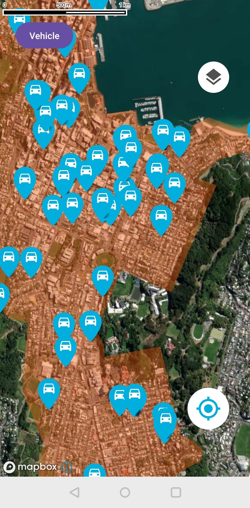

#  Mevo Car Finder (Android) 

## Introduction:

The purpose of this program is to utilize the Mevo public API to retrieve the coordinates of vehicle
locations (for testing purposes) and area boundaries, and to plot them on a map. It also provides
simple functionalities such as finding the nearest vehicle and toggling map styles.   
During development, basic aspects of Android development were considered, such as obtaining location
permissions, layout for both portrait and landscape orientations, data passing within the lifecycle,
and local storage for user settings. Due to network requests, coroutines were employed to handle
network responses. Data is obtained on the coroutine, and the map markers are rendered on the main
thread, ensuring a smoother user experience.   
The source code includes navigation module-related code, although it's currently in experimental
mode and not enabled due to compatibility conflicts with the map module.

## Snapshoot

  |  |  
------------------------------|------------------------------|------------------------------
 Vehicles and flex zone       | Show the nearest car         | Control panel                

## Features

- Displaying the vehicle positions on the map
- Fetching the branded pin asset from URL
- Mevo’s Flex Parking Zones plotting
- Smooth camera animations
- Finding the closest car
- Display in 3D perspectives

## Tech Stack

| Type              | Name                        |
|-------------------|-----------------------------|
| Language          | Kotlin                      |
| Platform          | Android                     |
| Map SDK           | MapBox                      |
| Architectural     | MVVM (Model-View-ViewModel) |
| Data Transmission | HTTPS                       |

## Known Issues

1. The camera perspective resets when switching between landscape and portrait mode.

## Future Enhancement

- Currently, finding the nearest vehicles is based on the spherical linear distance between two
  coordinate points. However, with the addition of navigation functionality, it will be possible to
  calculate the actual path distance, which would be more meaningful.
- After locating the nearest vehicle, it's possible to replace the default map marker with a more
  prominent one to help users distinguish among multiple vehicles. This would involve labeling,
  searching, and replacing a specific map marker.

## License

free
